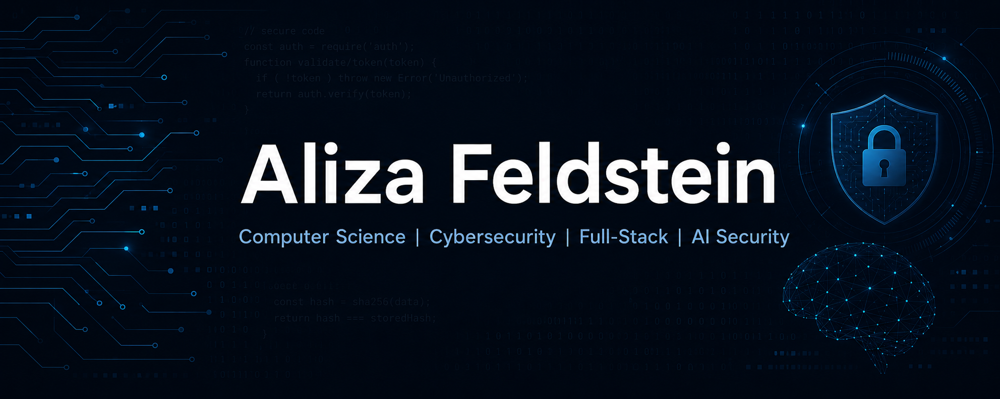

# Aliza Feldstein 

**Computer Science Student | Full-Stack Developer | Cybersecurity**

I am a Computer Science student at Ariel University, specializing in Cybersecurity.  
I have experience in full-stack development, automation, machine learning, and AI-based security projects.

---

## About Me

🎓 B.Sc. Computer Science, Cybersecurity Track  
💻 Angular, Python, REST APIs, frontend/backend integration  
🛡 Cybersecurity, malware analysis, threat detection  
🤖 Machine learning and AI security projects  
⚙️ Automation with Microsoft Power Automate  
🎖 Former Unit 8200 soldier  

## Tech Stack

---
